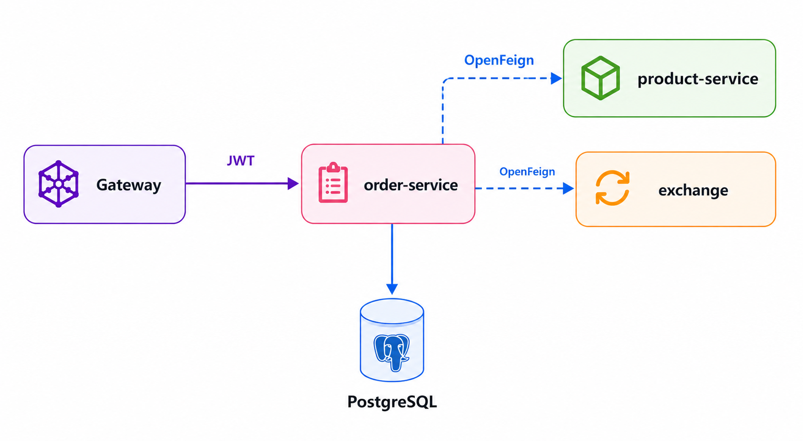

# ⚙️ Order Service — Implementation

> Parte do projeto **microservices-26-1** · Plataformas, Microserviços, DevOps e APIs — 2026.1

[](https://openjdk.org/)
[](https://spring.io/projects/spring-boot)
[](https://www.postgresql.org/)
[](https://www.docker.com/)
[](LICENSE)

**Responsável:** Ana Beatriz da Cunha

---

## 📌 Sobre

Implementação completa da **Order API** — responsável por gerenciar os pedidos dos usuários autenticados. Integra-se com a Product API (validação de produtos) e a Exchange API (conversão de moedas).



---

## 🚀 Como Rodar

### Localmente (com Docker Compose)

```bash
# A partir do repositório principal microservices
docker compose up order-service -d
```

### Standalone

```bash
# Requisitos: Java 21, PostgreSQL rodando

# Configurar variáveis de ambiente
export SPRING_DATASOURCE_URL=jdbc:postgresql://localhost:5432/order
export SPRING_DATASOURCE_USERNAME=order
export SPRING_DATASOURCE_PASSWORD=order
export PRODUCT_URL=http://localhost:8081
export EXCHANGE_URL=http://localhost:8082

# Build e run
mvn clean package -DskipTests
java -jar target/order-service-*.jar
```

### Com Docker

```bash
docker build -t order-service .
docker run -p 8080:8080 \
  -e SPRING_DATASOURCE_URL=jdbc:postgresql://host.docker.internal:5432/order \
  order-service
```

---

## 📡 Endpoints

### `POST /orders` — Criar pedido

> ⚠️ Requer token JWT válido

```bash
curl -X POST http://localhost:8080/orders \
  -H "Authorization: Bearer <token>" \
  -H "Content-Type: application/json" \
  -d '{
    "items": [
      { "idProduct": "uuid-do-produto", "quantity": 2 }
    ]
  }'
```

**Resposta `201 Created`:**
```json
{
  "id": "0195ac33-73e5-7cb3-90ca-7b5e7e549569",
  "date": "2025-09-01T12:30:00",
  "items": [
    {
      "id": "01961b9a-bca2-78c4-9be1-7092b261f217",
      "product": { "id": "uuid-do-produto" },
      "quantity": 2,
      "total": 20.24
    }
  ],
  "total": 20.24
}
```

---

### `GET /orders` — Listar pedidos

```bash
curl http://localhost:8080/orders \
  -H "Authorization: Bearer <token>"
```

---

### `GET /orders/{id}` — Detalhar pedido

```bash
# Em USD (padrão)
curl http://localhost:8080/orders/0195ac33-73e5-7cb3-90ca-7b5e7e549569 \
  -H "Authorization: Bearer <token>"

# Em BRL (via Exchange API)
curl "http://localhost:8080/orders/0195ac33-73e5-7cb3-90ca-7b5e7e549569?currency=BRL" \
  -H "Authorization: Bearer <token>"
```

---

## 🏗️ Estrutura do Projeto

```
📁 order-service/
├── 📁 src/
│   └── 📁 main/
│       ├── 📁 java/store/order/
│       │   ├── 📁 controller/
│       │   │   └── OrderController.java
│       │   ├── 📁 service/
│       │   │   └── OrderService.java
│       │   ├── 📁 repository/
│       │   │   └── OrderRepository.java
│       │   ├── 📁 model/
│       │   │   ├── Order.java
│       │   │   └── OrderItem.java
│       │   ├── 📁 client/
│       │   │   ├── ProductClient.java
│       │   │   └── ExchangeClient.java
│       │   └── OrderServiceApplication.java
│       └── 📁 resources/
│           └── application.yaml
├── 📄 Dockerfile
├── 📄 Jenkinsfile
└── 📄 pom.xml
```

---

## ⚙️ Configuração (`application.yaml`)

```yaml
server:
  port: 8080

spring:
  application:
    name: order-service
  datasource:
    url: ${SPRING_DATASOURCE_URL:jdbc:postgresql://localhost:5432/order}
    username: ${SPRING_DATASOURCE_USERNAME:order}
    password: ${SPRING_DATASOURCE_PASSWORD:order}
  jpa:
    hibernate:
      ddl-auto: update

product:
  url: ${PRODUCT_URL:http://product-service}

exchange:
  url: ${EXCHANGE_URL:http://exchange}

management:
  endpoints:
    web:
      exposure:
        include: health, prometheus
```

---

## 🧪 Testes

```bash
mvn test
```

---

## 🐳 Dockerfile

```dockerfile
FROM eclipse-temurin:21-jre-alpine
WORKDIR /app
COPY target/order-service-*.jar app.jar
EXPOSE 8080
ENTRYPOINT ["java", "-jar", "app.jar"]
```

---

## 🔄 CI/CD

Pipeline automatizado com **Jenkins**:

1. `Checkout` → `Build (Maven)` → `Test` → `Docker Build & Push` → `Deploy (EKS)`

Veja o [`Jenkinsfile`](Jenkinsfile) para detalhes.

---

## 🔗 Repositórios Relacionados

| Repositório | Descrição |
|---|---|
| [order](https://github.com/microservices-26-1/order) | Interfaces e DTOs |
| [product-service](https://github.com/microservices-26-1/product-service) | Product API (integração via OpenFeign) |
| [exchange](https://github.com/microservices-26-1/exchange) | Exchange API (integração via OpenFeign) |
| [microservices](https://github.com/microservices-26-1/microservices) | Repositório principal |
